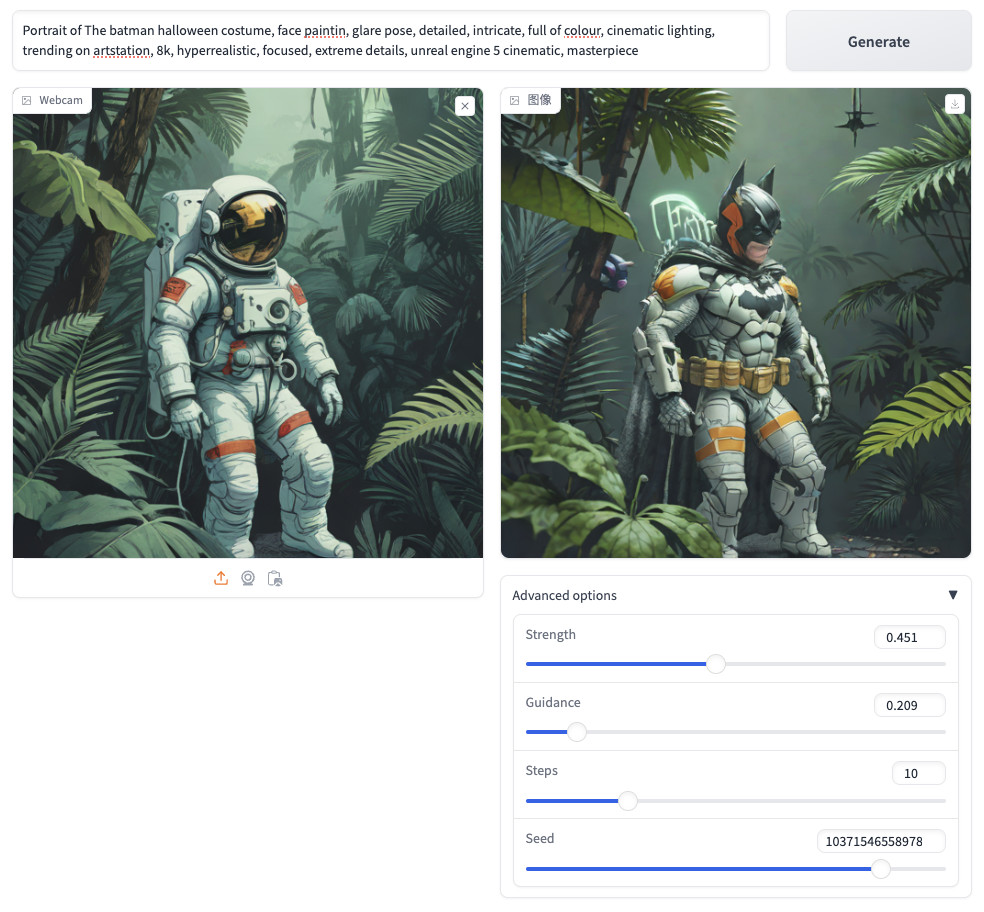

# Docker Stable Diffusion XL Turbo

《[Stable Diffusion XL Turbo 文生图和图生图实践](https://soulteary.com/2024/01/13/stable-diffusion-xl-turbo-image-generation.html)》

## 关联项目

- 《[使用 Docker 和 Diffusers 快速上手 Stable Video Diffusion 图生视频大模型](https://soulteary.com/2024/01/08/stable-video-diffusion-quick-start-with-docker-and-diffusers.html)》
- 《[使用 Docker 快速上手 Stability AI 的 SDXL 1.0 正式版](https://soulteary.com/2023/07/29/get-started-with-stability-ai-sdxl-1-0-release-using-docker.html)》
